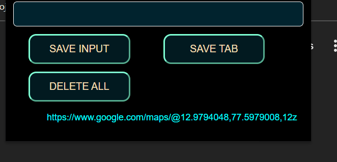

# copy url chrome extention
---
### 1) copies The url from the tab and stores it 
### in the local storage in the broser
### or u can give  the input and hit save
---
#### The chrome extention preview 

---

