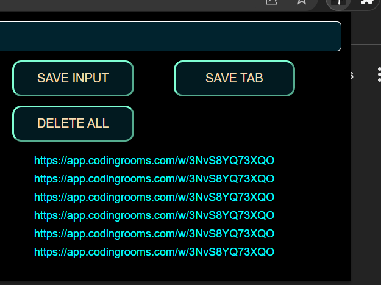

# copy url chrome extention
---
### 1) copies The url from the tab 


#####  use the chrome api
```
chrome.tabs.query({
    active: true,
    currentWindow: true
}, function(tabs) {
    var tabURL = tabs[0].url;
    console.log(tabURL);
});

```
---

### 2)and stores it in the local storage in the broser

##### Window.localStorage

```
Window.localStorage is used for storage


```
setItem 
```
localStorage.setItem('myCat', 'Tom');

```
getItem
```
const cat = localStorage.getItem('myCat');

```
clear
```
localStorage.clear();

```
---

### 3) or u can give  the input and hit save

```
we can use DOM and addevntlistner and then store in Window.localStorage
```
---
#### The chrome extention preview 


---


